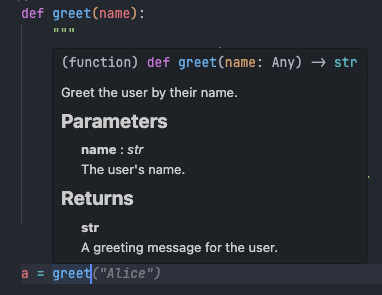
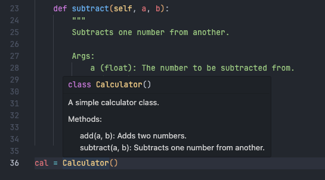
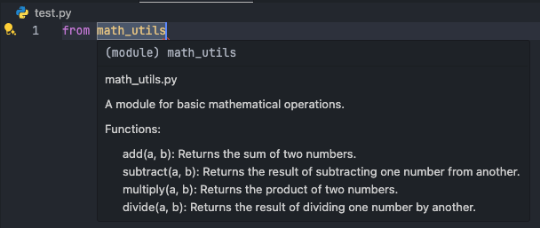

# Python Docstring

Docstrings are an essential part of writing clear, understandable, and maintainable Python code. They provide documentation directly in the code to describe what functions, classes, or modules do.

In this tutorial, you’ll learn:

- What docstrings are
- How to write docstrings
- Standard formats for docstrings (PEP 257, NumPy, and Google style)
- Examples of writing docstrings for functions, classes, and modules

---

## 1. What is a Docstring?

A docstring is a string literal that appears right after the definition of a function, method, class, or module in Python. It’s used to explain the purpose of the code and is enclosed within triple quotes (""" """) so that it can span multiple lines.

Python’s built-in help system can display these docstrings to provide a quick reference to anyone using your code.

```python
def add(a, b):
    """
    Adds two numbers and returns the result.

    Parameters:
        a (int): The first number.
        b (int): The second number.

    Returns:
        int: The sum of the two numbers.
    """
    return a + b
```

---

## 2. How to Write Docstrings

### Basic Syntax

- Start and end with triple quotes: """ """.
- Write the first line as a summary.
- Optionally, include more detailed explanations after a blank line.
- Document parameters, return values, exceptions, etc.

### PEP 257 Guidelines

PEP 257 specifies conventions for docstrings. Key points include:

- The docstring should be a complete sentence.
- For multi-line docstrings, the summary line should be followed by a blank line.
- Place docstrings immediately after the function, class, or module declaration.

---

## 3. Docstring Formats

### 3.1  PEP 257 Style

The PEP 257 style is concise and follows basic Python documentation conventions.

```python
def multiply(a, b):
    """Multiply two numbers and return the result."""
    return a * b
```

### 3.2  Google Style

The Google style provides a structured format, especially useful for documenting parameters and return types.

```python
def divide(a, b):
    """
    Divide two numbers.

    Args:
        a (float): The dividend.
        b (float): The divisor.

    Returns:
        float: The result of the division.

    Raises:
        ValueError: If the divisor is zero.
    """
    if b == 0:
        raise ValueError("The divisor cannot be zero.")
    return a / b
```

### 3.3 NumPy Style

The NumPy style is commonly used in scientific libraries. It is similar to Google style but with more formatting for parameters and returns.

```python
def subtract(a, b):
    """
    Subtract one number from another.

    Parameters
    ----------
    a : int
        The number to be subtracted from.
    b : int
        The number to subtract.

    Returns
    -------
    int
        The result of the subtraction.
    """
    return a - b
```

### NOTE

`IN VLAI code style, we use the Google style for docstrings.`

---

## 4. Examples of Docstrings for Different Elements

In this section, we’ll provide examples of docstrings for functions, classes, and modules using the Google style. After including these docstrings in your code, you can inspect them by hovering over the function, class, or module name.

### 4.1 Function Docstring

```python
def greet(name):
    """
    Greet the user by their name.

    Parameters:
        name (str): The user's name.

    Returns:
        str: A greeting message for the user.
    """
    return f"Hello, {name}!"
```

Inspecting



### 4.2 Class Docstring

```python
class Calculator:
    """
    A simple calculator class.

    Methods:
        add(a, b): Adds two numbers.
        subtract(a, b): Subtracts one number from another.
    """

    def add(self, a, b):
        """
        Adds two numbers.

        Args:
            a (float): The first number.
            b (float): The second number.

        Returns:
            float: The sum of the two numbers.
        """
        return a + b

    def subtract(self, a, b):
        """
        Subtracts one number from another.

        Args:
            a (float): The number to be subtracted from.
            b (float): The number to subtract.

        Returns:
            float: The result of the subtraction.
        """
        return a - b
```

Inspecting



### 4.3 Module Docstring

At the top of a Python file, you can include a docstring in Google format to describe the module's purpose.

```python
"""
math_utils.py

A module for basic mathematical operations.

Functions:
    add(a, b): Returns the sum of two numbers.
    subtract(a, b): Returns the result of subtracting one number from another.
    multiply(a, b): Returns the product of two numbers.
    divide(a, b): Returns the result of dividing one number by another.
"""
```

Inspecting



### 4.4 Exception Handling in Function Docstring

```python
def divide(a, b):
    """
    Divides one number by another.

    Args:
        a (float): The dividend.
        b (float): The divisor.

    Returns:
        float: The result of the division.

    Raises:
        ValueError: If the divisor is zero.
    """
    if b == 0:
        raise ValueError("The divisor cannot be zero.")
    return a / b
```

## Summary

Docstrings are a powerful way to document your code and help others understand and use it effectively. By using consistent and informative docstrings, you make your code easier to read, maintain, and debug.

Next, we will to learn how to using `typing` module to add type hints to docstrings. See [Python Typing](./2.argument_typing.md).
