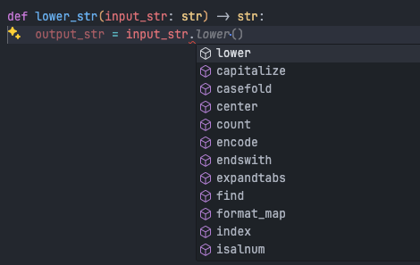
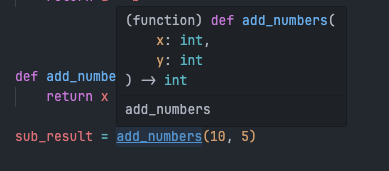
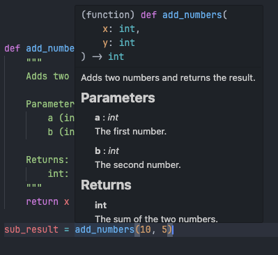

# Python `Typing`

Adding type annotations to your Python functions helps in documenting expected inputs and outputs, making your code more understandable and reducing errors.

In this tutorial, you’ll learn:

- What type annotations are
- How to add type hints to functions
- Using type hints with variables, lists, dictionaries, and more

---

## 1. What Are Type Hints?

Type hints (introduced in Python 3.5) allow you to specify the expected types of variables, parameters, and return values in functions. They don’t enforce the types at runtime but are useful for:

- Improving code readability
- Assisting IDEs with autocompletion and suggestions
- Providing hints for static analysis tools

Example:

When you define a function, you can specify the types of the parameters and return value using colons and arrows. Then you can see some suggestions in your IDE for your arguments.



More over, you can use type hints for fast description of your function. For example:

```python
def add_numbers(x: int, y: int) -> int:
    return x + y
```

Inspecting the function signature, you can quickly understand the expected types and return value.



We also combine type hints with docstrings to provide more detailed information about the function. The result like this:



---

## 2. Basic Type Annotations

Python’s built-in types can be annotated easily:

- `int`: Integer values
- `float`: Floating-point values
- `str`: Strings
- `bool`: Boolean values

Example:

```python
def greet(name: str) -> str:
    return f"Hello, {name}!"
```

## 3. Complex Data Types

Python’s typing module provides support for complex types:

- `List`: Annotates a list of a specified type
- `Tuple`: Annotates tuples with specified types
- `Dict`: Annotates dictionaries with specified key-value types
- `Union`: Annotates multiple possible types

Example:

```python
from typing import List, Dict, Union

def process_data(data: List[int], config: Dict[str, Union[int, str]]) -> List[int]:
    # Function logic
    return data
```

## Summary

Using type hints with Google-style docstrings improves code readability, making it easier for others to understand function requirements and outputs. The combination of typing and clear docstrings helps in maintaining quality, readable, and well-documented Python code.

Next, we will to learn how to using `argparse` module in python See [Python argparse](./3.ArgumentParser.md).
